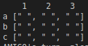
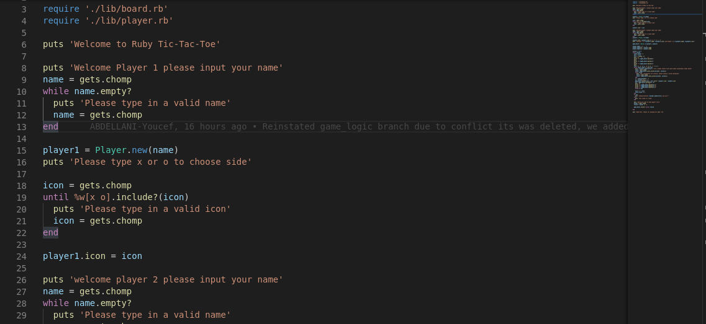
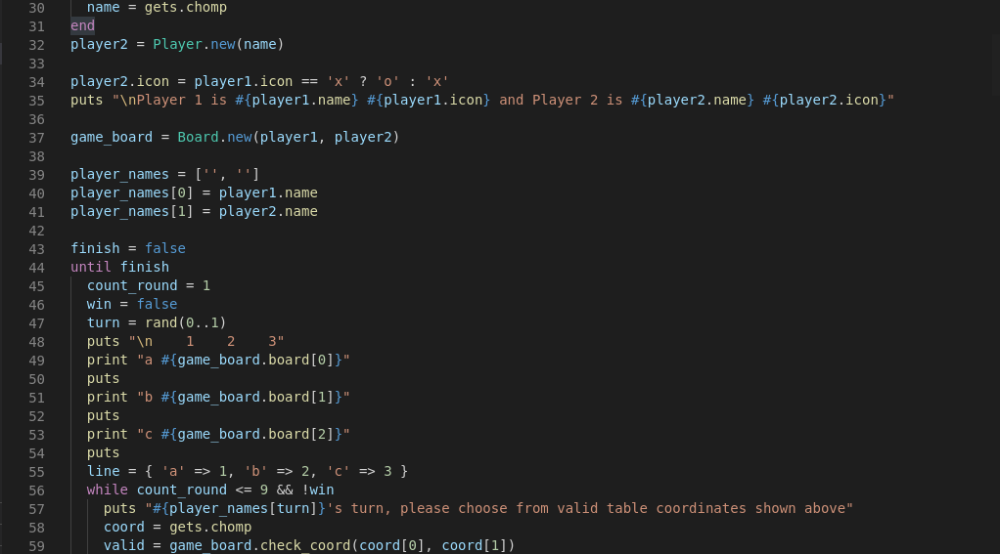

# Ruby Tic-Tac-Toe
Ruby's Tic-Tac-Toe Project

In this project, we have created a game of Tic-Tac-Toe using:

- Classes for board and player instances
- An Interface loop 
- Win check method
- Turn input validity methods
- Player name validity check
- Restart method

## Setup

- Download or clone the repository's files [github repo](https://github.com/jurgen1c/Ruby-Tic-Tac-Toe.git)
- Have Ruby 2.7 installed (to check if it is installed you can run: ruby -version in your console)
- Once repo is downloaded to local directory, in you console run cmd: ruby bin/main.rb
- Enjoy the game!

## How to Play

- Tic-Tac-Toe is a two player game were each must try to place three of their tokens in a row, vertically, horizontally or diagonally, in a three by three board to win.

- Game board will be displayed in a coordinate table from a to c (lines) and 1 to 3 (columns), Example input a1 will place token in the first line and first column.

  

- At the beginning each player will be asked to input their name's and token of preference.

- After which a random player will picked to start and place a token.

- Each player take turns to place a token until one has won or the game is a draw

- Once game is over player may restart by typing "y" in the console or exit by typing "n".

## Screenshot

## Built With

- Code editor: VsCode
- Language: Ruby
- Linters: Rubocop, Rspec

## Live Demo

[Live Demo Link](https://repl.it/@JurgenClausen/main#main.rb)

### Prerequisites

- Browser (Google Chrome, Mozilla Firefox, Safari or any other browser)

## Authors

👤 **Youcef Abdellani**

- Github: [@ABDELLANI-Youcef](https://github.com/ABDELLANI-Youcef)
- Twitter: [@YoucefAbdellani](https://twitter.com/YoucefAbdellani)
- Linkedin: [linkedin](https://www.linkedin.com/in/youcef-abdellani-b79361124/) 

👤 **Jurgen Clausen Gutierrez**

- Github: [@jurgen1c](https://github.com/jurgen1c)
- LinkedIn: [jurgen-clausen](https://www.linkedin.com/in/jurgen-clausen-2740061a9/)

## 🤝 Contributing

Contributions, issues and feature requests are welcome!

Feel free to check the [issues page](https://github.com/happiguru/Enumerable_methods).

## Show your support

Give a ⭐️ if you like this project!

## Acknowledgments

- Microverse
- GitHub
- TheOdinProject
- Ruby

## 📝 License

This project is [MIT](lic.url) licensed.
